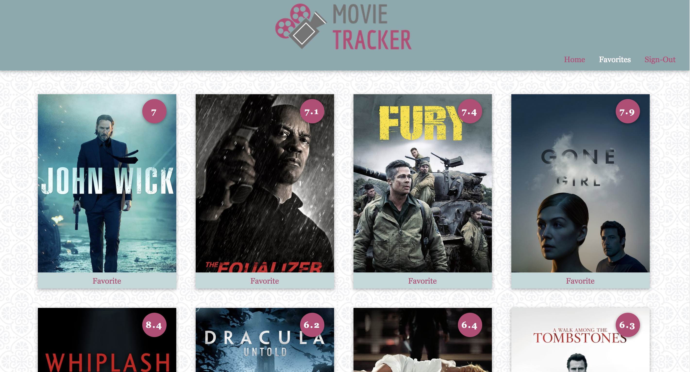

# Movie-Tracker
Movie-Tracker is an app designed to display data using the moviedb API.  It has functionality allowing users to view upcoming movies, their description and their overall rating.  Users are also able to select favorites from from the list of movies and view them later under the favorites button. The main goal of this project was to learn about how to use redux, router, TDD as well as gain a better understanding of react.

## Getting Started
These instructions will get you a copy of the project up and running on your local machine for development and testing purposes. See deployment for notes on how to deploy the project on a live system.

### Installing
Clone the repositorys (git clone https://github.com/gavin-love/MovieTracker.git) & (git clone https://github.com/turingschool-examples/movie-tracker).

run npm install
then run npm start

## Running the tests
In the terminal, run npm test

## Built With
* [Creat-React-App](https://github.com/facebook/create-react-app)

## Authors
***Gavin Love** - *Initial work* - [gavin-love](hhttps://github.com/gavin-love)

***Alan Charles** - *Initial work* - [abomb14c](https://github.com/abomb14c)

***Keeliana Marler** - *Initial work* - [kmarler2](https://github.com/kmarler2)
